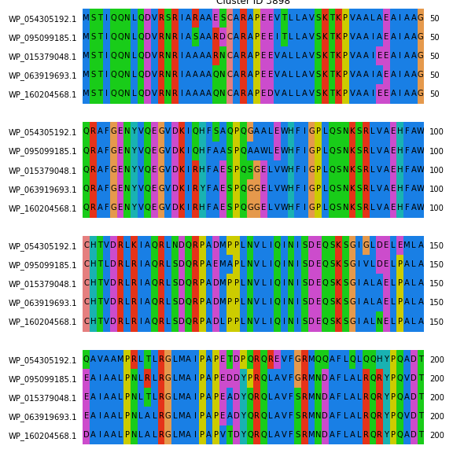

# hse22_project

## Ссылка на колаб

## Общая информация

| Вид | Имя в колабе | Кол-во посл-ей в геноме | Общая длина генома | Кол-во аннотированных генов | Покрытие генома генами | Кол-во участков с zh-score > 500 | Общая длина участков с zh-score > 500 |
|:------------------:|:------------------:|:------------------:|:-:|:------------------:|:------------------:|:------------------:|:------------------:|
| Serratia nematodiphila | GCF_004768745.1_ASM476874v1 | 1 | 5256558     | 4987 | 88.73% |58531 | 615873 |
| Serratia surfactantfaciens | GCF_001642805.2_ASM164280v2 | 1 | 5117644 | 4882 | 88.87% | 56276 | 591392 |
| Serratia ureilytica | GCF_017309605.1_ASM1730960v1 | 1 | 5102941       | 4826 | 88.86% | 58197 | 612227 |
| Serratia rubidaea | GCF_016026735.1_ASM1602673v1 | 1 | 4995010         | 4701 | 88.12% | 53100 | 557416 |
| Serratia ficaria | GCF_900187015.1_50465_F01 | 1 | 5209973             | 4875 | 88.69% |54549 | 570729 |

### Распределения значений zh-score:

## Информация по полученным гомологичным кластерам

Всего кластеров: 5036

### Гистограмма по кол-ву геномов:

## Таблица с информацией по выбранным кластерам

**Таблица соответствия индексов:**

*   0 -> Serratia nematodiphila -> GCF_004768745.1_ASM476874v1
*   1 -> Serratia surfactantfaciens -> GCF_001642805.2_ASM164280v2
*   2 -> Serratia rubidaea -> GCF_016026735.1_ASM1602673v1
*   3 -> Serratia ficaria -> GCF_900187015.1_50465_F01
*   4 -> Serratia ureilytica -> GCF_017309605.1_ASM1730960v1

**Выбранные кластеры в колабе:**

**Информация по кластерам:**

| ID кластера | Кол-во генов в кластере | Функции генов      | Расположение Z-DNA относительно генов | Z-DNA score средний по генам |
|:----------------------: |:----------------------: |:------------------:| :-----------------------------------: | :---------: |
| 782 | 5   | WP_019452586.1	WP_004934121.1	WP_015344092.1	WP_033645063.1	WP_061797917.1 | Располагается в промоторе гена | 324166.716 |
| 3897 | 5  | WP_063919692.1	WP_135638616.1	WP_054305193.1	WP_047573684.1	WP_095099182.1 | Располагается в промоторе гена | 207223.1408 |
| 3898 | 5 | WP_063919693.1	WP_015379048.1	WP_054305192.1	WP_160204568.1	WP_095099185.1   | Располагается в начале гена    | 207223.1408 |
| 2314 | 5 | WP_025160386.1	WP_082997395.1	WP_054306763.1	WP_103101717.1	WP_061798733.1   | Располагается в начале гена    | 206143.73032 |
| 259 | 5 | WP_004933629.1	WP_004933629.1	WP_015670575.1	WP_004933629.1	WP_061799898.1   | Располагается в промоторе гена | 138924.1 |

## Множественное белковое выравнивание для каждого выбранного кластера

## Визуализация расположения участков Z-DNA для каждого выбранного кластера

## Бонус

## Визуализация расположения квадруплексов для каждого выбранного кластера

Консервативность квадруплексов наблюдается только для кластера 3897, для двух гомологов
